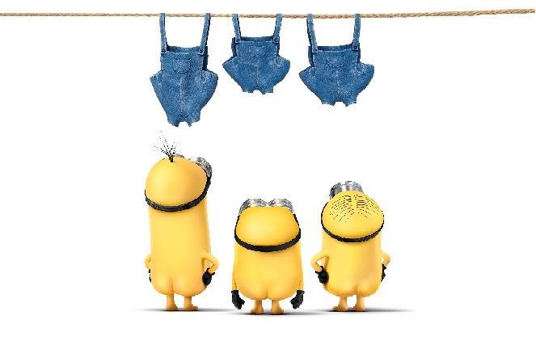

$$\nabla f = \mathrm{mag}(\nabla \mathbf{f}) = \sqrt{(\frac{\partial f}{\partial x})^2 + (\frac{\partial f}{\partial y})^2} = \sqrt{(G_x)^2 + (G_y)^2}$$

# Overview
Please write down outline of your porject.
也可以寫中文。
* 第一點
* 第二點

# Implementation
Write down how you work on your project.<br/>
You can enbed your **code** here:<br/>
```
#include <opencv2\opencv.hpp>
int main(){
cv::Mat color = cv::imread("C:/opencv249/sources/samples/cpp/tutorial_code/images/lena.png", 1);
cv::Mat gray = cv::imread("C:/opencv249/sources/samples/cpp/tutorial_code/images/lena.png", 2);
cv::imshow("color", color);
cv::imshow("gray", gray);
cv::waitKey(0);
return 0;
}
```
Descript how these code files work.
<li><code><font color="green">proj1.cpp</font></code> The main file of project blabla....</li>	<br/>
<li><code><font color="green">func1.cpp</font> </code> blabla....<br/> 
<li><code><font color="green">func2.cpp</font> </code> blabla....<br/> 

# Theory
Please explain the *background theorem* of project.<br/>
* thm 1
* thm 2
* thm 3

# Disparity result
Show result of your project:<br/>


# Reference
1.  ref paper 1<br/>
2.  ref paper 2<br/>

<style TYPE="text/css">
code.has-jax {font: inherit; font-size: 100%; background: inherit; border: inherit;}
</style>
<script type="text/x-mathjax-config">
MathJax.Hub.Config({
    tex2jax: {
        inlineMath: [['$','$'], ['\\(','\\)']],
        skipTags: ['script', 'noscript', 'style', 'textarea', 'pre'] // removed 'code' entry
    }
});
MathJax.Hub.Queue(function() {
    var all = MathJax.Hub.getAllJax(), i;
    for(i = 0; i < all.length; i += 1) {
        all[i].SourceElement().parentNode.className += ' has-jax';
    }
});
</script>
<script type="text/javascript" src="http://cdn.mathjax.org/mathjax/latest/MathJax.js?config=TeX-AMS-MML_HTMLorMML"></script>
